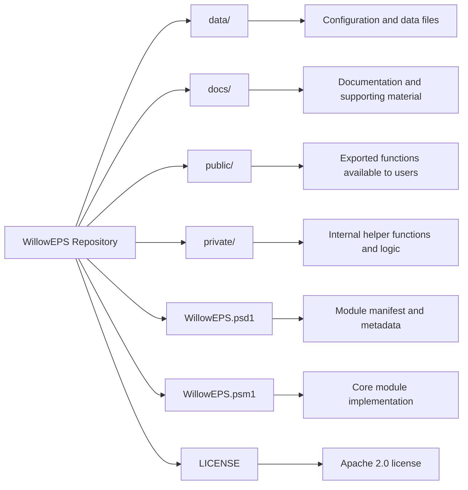

# WillowEPS

A PowerShell module for managing printer configurations across Epic Willow EPS servers.  
Designed to support consistent configuration management in multi-environment Epic EPS deployments, while remaining flexible enough for use in any EPS-based infrastructure.

---

## Overview

WillowEPS provides a structured approach to managing and standardizing printer configurations across multiple EPS servers.

The module is built to:
- Centralize printer configuration management
- Improve consistency across environments (Prod / Non-Prod / Testing)
- Reduce manual configuration drift
- Support automation in EPS-related workflows

Although designed for Epic Willow EPS environments, it can be used with any system requiring coordinated printer configuration management across multiple servers. [1](https://github.com/figueroadavid/WillowEPS)  

---

## Features

- Centralized printer configuration management
- Multi-server coordination
- Environment-aware design (supports segmented environments)
- Scriptable and automation-friendly
- Modular PowerShell architecture

---

## Repository Structure




---

## Requirements

- PowerShell 5.1 (assumed baseline)
- Administrative privileges (for printer and service operations)
- Access to target EPS servers

---

## Installation

Clone the repository:

```powershell
git clone https://github.com/figueroadavid/WillowEPS.git
```
