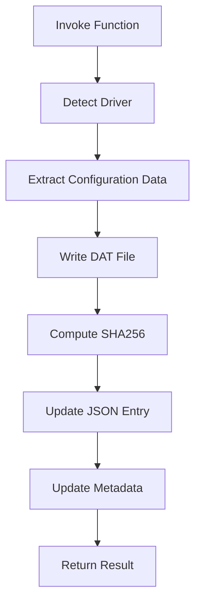

# Add-WEPSDriverConfig

## Overview

`Add-WEPSDriverConfig` is a public function within the WillowEPS module responsible for adding or updating printer driver configuration entries within the `DriverConfigInfo.JSON` structure. It manages the relationship between installed printer drivers, their associated configuration DAT files, and integrity validation metadata, ensuring a consistent and validated driver configuration cache.

## Purpose

The function is used to register new printer driver configurations, update existing driver entries, associate driver metadata with configuration DAT files, and maintain integrity tracking via SHA256 hashes. It ensures that all entries conform to the expected schema and remain compatible with the module’s configuration model.

## Data Dependencies

This function interacts with `DriverConfigInfo.json` by reading existing entries and inserting or updating records in the Drivers collection. It also interacts with the local DAT cache, where configuration data derived from printer drivers is stored, and uses installed printer driver information from the system to populate the metadata fields.

## Expected Driver Entry Structure
Each driver entry maintained by the function follows this structure:

```json 
{
  "Name": "Driver Name",
  "DriverVersion": "0",
  "DriverVersionString": "Version String",
  "DATFilePath": "Local Path",
  "SHA256": "Hash Value"
}
```

## Execution Flow

#### Mermaid 



#### Plain Text
```text
Start[Invoke Function] --> Detect[Detect Driver]
    Detect --> Extract[Extract Configuration Data]
    Extract --> WriteDAT[Write DAT File]
    WriteDAT --> Hash[Compute SHA256]
    Hash --> UpdateJSON[Update JSON Entry]
    UpdateJSON --> UpdateMeta[Update Metadata]
    UpdateMeta --> End[Return Result]
```

## Key Behaviors

The function adds new driver entries when they do not already exist and updates existing entries when the driver version or DAT file hash has changed. It ensures that entries are not duplicated, that all fields are consistent with the schema, and that integrity checks are maintained using SHA256 values.

## Idempotency

The function is designed to be idempotent. Repeated execution against unchanged drivers does not produce duplicate entries or unnecessary updates. Changes are only written when there is a detectable difference in driver version or configuration data.

## Validation

The function is expected to validate that the specified driver exists on the system, that configuration data can be successfully extracted, that the DAT file can be written and accessed, and that the JSON structure remains valid before committing changes.

## Error Handling

The function should handle scenarios involving missing or invalid driver names, inaccessible file paths, JSON parsing or serialization failures, and hash computation errors. All errors should be structured in a way that allows for integration into automated workflows.

## Usage Context

This function is intended for enterprise EPS administration scenarios where printer driver configurations must be standardized across multiple systems. It supports the creation and maintenance of a centralized configuration catalog and enables reliable synchronization between local systems and shared configuration data.

## Notes

All modifications performed by this function impact `DriverConfigInfo.json` and may require recomputation of metadata fields such as SourceHash. The SHA256 values stored in the configuration are intended for integrity verification only and are not designed as a security control.

## Add-WEPSDriverConfig — Key Parameters and Examples

### Parameters

`-DriverName`
        The exact name of the installed driver to add.

`-DATFilePath`
        The path to the .dat file.

`-PushToSource`
        If specified, attempts to copy the updated local cache back to the shared
        source location after a successful local update.

`-WhatIf`
        Shows what would happen if the command ran.

`-Confirm`
        Prompts for confirmation before proceeding.


### Expected Output Behavior

The function updates DriverConfigInfo.json rather than returning raw data. It modifies:
- Driver entries
- DATFilePath
- SHA256 hash
- Metadata fields where applicable

### Examples

Add a new driver configuration:
```powershell
Add-WEPSDriverConfig -Name 'Microsoft Print To PDF'
```

Update an existing driver configuration:
```powershell
Add-WEPSDriverConfig -Name 'Microsoft Print To PDF'
```

Force refresh of a configuration:
```powershell
Add-WEPSDriverConfig -Name 'Microsoft Print To PDF' -Force
```

Bulk processing pattern:
```powershell
Get-PrinterDriver | ForEach-Object { Add-WEPSDriverConfig -Name $_.Name }
```

### Operational Notes

- Driver matching requires exact name alignment
- Version comparison controls update behavior
- SHA256 is used for integrity validation of DAT files
- Function execution is idempotent
- JSON updates follow the defined schema in DriverConfigInfo.json